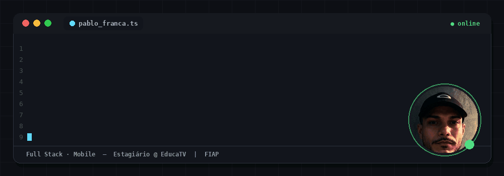
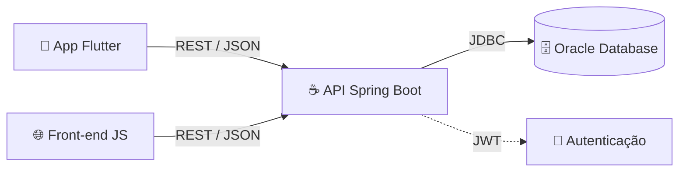

<div align="center">



<a href="https://www.linkedin.com/in/pablo-fran%C3%A7a-a2307124a">
  
</a>

<br/>


</div>

> [!NOTE]
> Estudante de **Análise e Desenvolvimento de Sistemas na FIAP** e **estagiário na EducaTV, pela Prefeitura**. Aqui você encontra meus projetos, minha stack e minha evolução como desenvolvedor.

---

## 👨‍💻 Sobre mim

Sou desenvolvedor **Full Stack**: trabalho com **Java e Spring Boot** no back-end, **Oracle** no banco de dados, **HTML, CSS e JavaScript** no front-end e **Flutter** para mobile. Gosto de construir soluções escaláveis, do banco de dados até a interface.

```text
$ whoami
pablo-franca

$ cat status.txt
📍 Estagiando na EducaTV (Prefeitura)
🎓 Cursando ADS na FIAP
🔭 Construindo APIs REST e apps mobile
🌱 Estudando arquitetura de software e cloud
```

---

## 🧬 Como eu construo (arquitetura)



---

## 🚀 Stack

| Área | Tecnologias |
|--------|--------|
| **Back-end** | Java, Spring Boot, APIs REST, POO, Arquitetura em Camadas |
| **Banco de Dados** | Oracle Database, SQL, PL/SQL (Procedures), Modelagem Relacional |
| **Front-end** | HTML, CSS, JavaScript |
| **Mobile** | Flutter, Dart |
| **Ferramentas** | Git, GitHub, VS Code, Figma |

<p align="center">
  
</p>

---

## 💼 Experiência

**Estagiário · EducaTV (Prefeitura)**

- Atuo em projetos reais de tecnologia, colaborando com a equipe no dia a dia.

<!-- Adicione aqui 2 ou 3 entregas concretas, ex.: "- Desenvolvi X", "- Automatizei Y" -->

---

## 📂 Projetos em destaque

<table>
  <tr>
    <td width="50%" valign="top">
      <h3>☕ API REST com Spring Boot</h3>
      <p>Arquitetura em camadas, autenticação JWT e integração com banco de dados.</p>
      <p><code>Java</code> <code>Spring Boot</code> <code>Oracle</code> <code>JWT</code></p>
      <a href="https://github.com/pablofranca-tech">👉 Ver repositório</a>
    </td>
    <td width="50%" valign="top">
      <h3>📱 App Mobile com Flutter</h3>
      <p>Consumo de APIs REST, gerenciamento de estado e interface responsiva.</p>
      <p><code>Flutter</code> <code>Dart</code> <code>REST API</code></p>
      <a href="https://github.com/pablofranca-tech">👉 Ver repositório</a>
    </td>
  </tr>
</table>

---

## 📊 Atividade no GitHub

<p align="center">
  
  
</p>

<p align="center">
  
  
</p>

<details>
<summary><b>📈 Gráfico de contribuições (clique para abrir)</b></summary>
<br/>
<p align="center">
  
</p>
</details>

<p align="center">
  <picture>
    <source media="(prefers-color-scheme: dark)" srcset="https://raw.githubusercontent.com/pablofranca-tech/pablofranca-tech/output/github-snake-dark.svg" />
    <source media="(prefers-color-scheme: light)" srcset="https://raw.githubusercontent.com/pablofranca-tech/pablofranca-tech/output/github-snake.svg" />
    
  </picture>
</p>

---

## 💡 Perfil em código

```java
public class PabloFranca {

    private final String formation = "Análise e Desenvolvimento de Sistemas - FIAP";
    private final String currentRole = "Estagiário - EducaTV";

    private final List<String> technologies = List.of(
            "Java", "Spring Boot", "Oracle Database", "JavaScript", "Flutter"
    );

    public String goal() {
        return "Construir soluções escaláveis, do banco de dados à interface";
    }
}
```

---

## 📫 Contato

<p align="center">
  <a href="mailto:pabloesdrasfranca@gmail.com">
    
  </a>
  <a href="https://www.linkedin.com/in/pablo-fran%C3%A7a-a2307124a">
    
  </a>
  <a href="https://github.com/pablofranca-tech">
    
  </a>
</p>

<p align="center">
  <strong>"Transformando aprendizado em soluções reais através da tecnologia."</strong>
</p>
